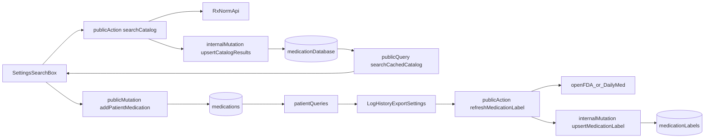

# Convex Medication Architecture

## Recommended Shape

Use Convex as the backend facade in front of RxNorm/openFDA/DailyMed:

## Backend Changes

### 1. Stabilize the schema in [convex/schema.ts](/Users/daniel/Code/p/rxlog/convex/schema.ts)

Keep the existing split between catalog data and per-patient assignments, but make it usable for normalized search plus detail enrichment.

- Evolve `medicationDatabase` into the cached catalog table.
- Keep `medications` as the patient-specific assignment table.
- Keep `medicationLabels` as the label/detail cache keyed to the catalog row, not the patient row.
- Add an optional link from `medications` to the catalog row, so a patient med can be selected from RxNorm but still keep patient-specific scheduling and dosage.
- Add a search index on the catalog display/search field so cached search can stay local and fast.
- Make catalog/detail fields optional where external sources may omit them.
- Prefer curated fields over storing full raw payloads; if you keep source payloads, store only a bounded subset to avoid large documents.

Suggested schema direction:

- `medicationDatabase`: `rxnormCui`, `displayName`, `genericName`, `brandName`, `strength`, `dosageForm`, `route`, `manufacturer`, `ndc`, `searchText`, `source`, `lastFetchedAt`
- `medicationLabels`: `medicationId`, `indications`, `warnings`, `adverseReactions`, `contraindications`, `source`, `sourceId`, `lastFetchedAt`, `staleAt`
- `medications`: add optional `catalogMedicationId`, plus patient-facing fields like `name`, `dosage`, `scheduledTimes`, `active`

### 2. Add Convex auth/access helpers

Create shared helpers in new Convex modules so every patient-scoped function checks access instead of trusting client input.

Files to add:

- [convex/users.ts](/Users/daniel/Code/p/rxlog/convex/users.ts)
- [convex/patients.ts](/Users/daniel/Code/p/rxlog/convex/patients.ts)
- [convex/lib/auth.ts](/Users/daniel/Code/p/rxlog/convex/lib/auth.ts)

Responsibilities:

- Resolve the Clerk identity from `ctx.auth.getUserIdentity()`.
- Upsert or look up the app user in `users` by `tokenIdentifier`.
- Assert that the caller belongs to the patient via `patientMembers` before reading or mutating any patient data.
- Return `forbidden`/`not found` semantics from Convex instead of letting routes infer access from mock data.

### 3. Split queries, mutations, and actions by responsibility

Add medication-specific Convex modules:

- [convex/medicationCatalog.ts](/Users/daniel/Code/p/rxlog/convex/medicationCatalog.ts)
- [convex/patientMedications.ts](/Users/daniel/Code/p/rxlog/convex/patientMedications.ts)
- [convex/medicationLabels.ts](/Users/daniel/Code/p/rxlog/convex/medicationLabels.ts)

Recommended function split:

- Public `query`: read cached catalog results and patient medication data.
- Public `mutation`: create/update/delete a patient's medication assignment.
- Public `action`: call RxNorm/openFDA/DailyMed.
- Internal `mutation`: upsert fetched catalog/label records.
- Internal `action` or scheduled job: refresh stale label data after assignment or on detail open.

Concrete functions to add:

- `medicationCatalog.searchCached({ query })`
- `medicationCatalog.searchAndCache({ query })` as an action that fetches RxNorm and persists normalized results
- `patientMedications.listForPatient({ patientId })`
- `patientMedications.add({ patientId, catalogMedicationId, dosage, scheduledTimes })`
- `patientMedications.remove({ patientMedicationId })`
- `patientMedications.getSchedule({ patientId, dayStart, dayEnd })`
- `patientMedications.getHistory({ patientId, start, end, medicationId? })`
- `medicationLabels.getForCatalogMedication({ medicationId })`
- `medicationLabels.refresh({ medicationId })` as an action that fetches openFDA/DailyMed and upserts cached sections

### 4. Use on-demand hydration first, then optional background refresh

For an MVP, avoid a broad nightly ingest. Fetch only what users actually search or open.

Default behavior:

- Search box calls `searchAndCache` with a debounce.
- Results are normalized and written into `medicationDatabase`.
- Settings and patient pages read only from Convex tables after that.
- When a medication detail panel opens, call `medicationLabels.getForCatalogMedication`.
- If the label is missing or stale, trigger `refresh` and show the last cached version or a loading state.

Optional later:

- Add [convex/crons.ts](/Users/daniel/Code/p/rxlog/convex/crons.ts) to refresh recently used medications or stale labels.

## Frontend Wiring

### 5. Replace `mock-data` reads across patient screens

Current screens already show exactly which Convex reads are needed; they just still point at [src/lib/mock-data.ts](/Users/daniel/Code/p/rxlog/src/lib/mock-data.ts).

Wire these routes to Convex:

- [src/routes/index.tsx](/Users/daniel/Code/p/rxlog/src/routes/index.tsx): patient list and summary counts
- [src/routes/\_authed/patients/$patientId.tsx](/Users/daniel/Code/p/rxlog/src/routes/_authed/patients/$patientId.tsx): patient header and access-aware loading
- [src/routes/\_authed/patients/$patientId/index.tsx](/Users/daniel/Code/p/rxlog/src/routes/_authed/patients/$patientId/index.tsx): today schedule query and log mutation
- [src/routes/\_authed/patients/$patientId/history.tsx](/Users/daniel/Code/p/rxlog/src/routes/_authed/patients/$patientId/history.tsx): filterable history query
- [src/routes/\_authed/patients/$patientId/export.tsx](/Users/daniel/Code/p/rxlog/src/routes/_authed/patients/$patientId/export.tsx): export preview query
- [src/routes/\_authed/patients/$patientId/settings.tsx](/Users/daniel/Code/p/rxlog/src/routes/_authed/patients/$patientId/settings.tsx): medication picker, add/remove, caretaker list

Use the repo’s existing Convex client pattern:

- route loaders with `convexQuery(...)` for page data
- reactive reads with `useSuspenseQuery(...)`
- actions/mutations for search and writes

### 6. Build the medication picker around cached search + remote hydrate

In [src/routes/\_authed/patients/$patientId/settings.tsx](/Users/daniel/Code/p/rxlog/src/routes/_authed/patients/$patientId/settings.tsx):

- Replace the free-text medication input with a debounced search field.
- Read cached matches from `searchCached`.
- If the cache is thin or empty, call `searchAndCache` to hydrate from RxNorm.
- Let the user choose a canonical medication row, then confirm patient-specific dosage and schedule before saving.
- Keep the selected catalog row id on the patient medication so detail enrichment stays linked later.

## Rollout Notes

### 7. Keep the migration low-risk

Because `convex/schema.ts` already contains medication tables, prefer additive changes first.

- Add new link/search fields as optional first.
- Backfill any derived search fields after schema deploy if needed.
- Do not make catalog-linked fields required until every patient medication can be populated safely.

### 8. Test the data flow end-to-end

Focus testing on the highest-risk edges:

- unauthorized user cannot read another patient’s medications
- repeated RxNorm searches upsert instead of duplicating catalog rows
- adding a patient medication stores both patient-specific schedule data and the linked canonical medication id
- missing/stale labels refresh correctly without blocking the entire patient page
- history/export screens can derive their current mock summaries from Convex data without extra client-side joins

## Key Implementation Notes

- Use Convex `action`s only for RxNorm/openFDA/DailyMed calls.
- Keep all DB writes in `mutation`/`internalMutation` functions.
- Search the local cache first for speed; treat external APIs as hydration, not the main live query path.
- Put all authorization in Convex, not in route components.
- Start with RxNorm search plus lazy label enrichment; add crons only after the core flow works.
